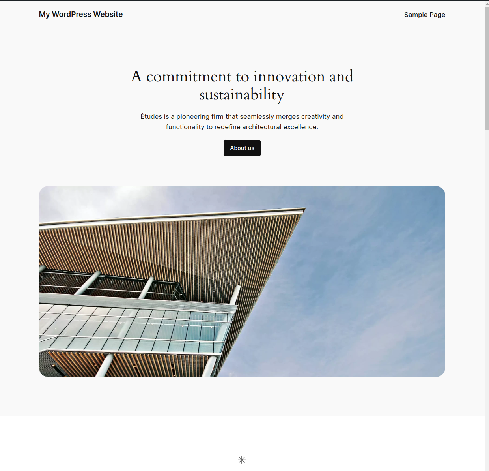
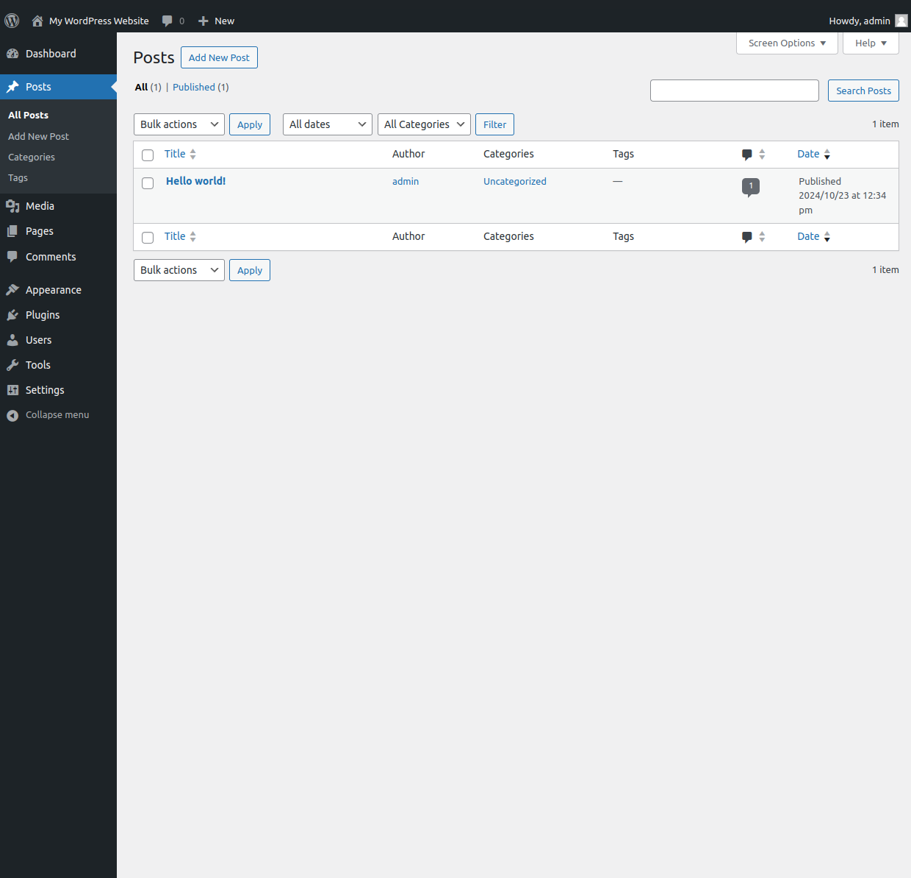

# Subscribers

Subscribers are a common pattern in the software engineering world.

In Launchpad, they are used to replace the callback registrations using `add_action` and `add_filter` registration which is always a pain to handle.

## Writing a subscriber
To transform a class into a subscriber, you need to use the annotation `@hook` inside of a method docblock.

```php
/**
* @hook init
 */
public function callback() {
    
}
```

### Hook annotation

The hook annotation accepts two parameters.

| Name      | Mandatory | Description                      |
|-----------|-----------|----------------------------------|
| Hook name | Yes       | Hook the callback is attached to |
| Priority  | No        | Callback priority                |

#### Hook name

The hook name is the action or the filter to which the callback is linked.

It is the equivalent of the first parameter from the function `add_action` or `add_filter`.

That way the following code:

```php
function change_sitemap_url($url, $path) {
    if( '/wp-sitemap.xml' !== $path) {
        return $url;
    }
    
    return str_replace($path, 'sitemap.xml', $url);
}

add_filter('home_url', 'change_sitemap_url', 10, 2);

function add_sitemap_rule() {
    add_rewrite_rule('sitemap\.xml', 'index.php?sitemap=index', 'top');
}

add_action('init', 'add_sitemap_rule');
```

Is equivalent to this one:

```php
/**
* @hook init
 */
public function add_sitemap_rule() {
    add_rewrite_rule('sitemap\.xml', 'index.php?sitemap=index', 'top');
}

/**
* @hook home_url
 */
public function change_sitemap_url($url, $path) {
    if( '/wp-sitemap.xml' !== $path) {
       return $url;
    }
    
    return str_replace($path, 'sitemap.xml', $url);
}
```

#### Callback priority

As it can have more than one callback linked to the same hook, it can be important to order them right.

That is why WordPress introduced priorities on hook callbacks that work the following way.

The priority is a number that reflects the order in which our callback should be executed.

For example, if I have a callback with a 10-priority and a 15-one, then the 10-priority callback will be executed before the 15-one.

**Note:** Hook callbacks have a priority of 10 by default.

On the `@hook` annotation it is possible to indicate the priority the following way:

```php
/**
* @hook init 15
 */
public function add_sitemap_rule() {
    add_rewrite_rule('sitemap\.xml', 'index.php?sitemap=index', 'top');
}
```

As the priority is not a mandatory parameter, then both of the following hook annotations are valid and equivalent:

```php
/**
* @hook init
 */
public function add_sitemap_rule() {
    add_rewrite_rule('sitemap\.xml', 'index.php?sitemap=index', 'top');
}

/**
* @hook init 10
 */
public function add_sitemap_rule() {
    add_rewrite_rule('sitemap\.xml', 'index.php?sitemap=index', 'top');
}
```

#### Callback linked to multiple hooks

Sometimes it arrives in WordPress that we want a callback to be linked to multiple events at the same time.

When using the `add_action` or the `add_filter` functions, it is possible to achieve the following way:

```php

function add_sitemap_rule() {
    add_rewrite_rule('sitemap\.xml', 'index.php?sitemap=index', 'top');
}

add_action('init', 'add_sitemap_rule');

add_action('admin_init', 'add_sitemap_rule');
```

With the `@hook` annotation is also possible and as simple as with the WordPress syntax:

```php
/**
* @hook init
* @hook admin_init
 */
public function add_sitemap_rule() {
    add_rewrite_rule('sitemap\.xml', 'index.php?sitemap=index', 'top');
}
```

### Summary

In this part, we will summarize how to create a subscriber.

We will first have
to create a regular class inside the [`inc` folder](https://github.com/wp-launchpad/launchpad-examples/tree/main/base/inc) from the project:

```php
class MyClass {

}
```

Once this is done, we will create one or multiple callback methods:
```php
class MyClass {
    /**
    * @hook init 2
     */
    public function add_sitemap_rule() {
        add_rewrite_rule('sitemap\.xml', 'index.php?sitemap=index', 'top');
    }
    
    /**
    * @hook home_url
     */
    public function change_sitemap_url($url, $path) {
        if( '/wp-sitemap.xml' !== $path) {
           return $url;
        }
        
        return str_replace($path, 'sitemap.xml', $url);
    }
}
```

**Note:** It is also possible to add methods on the subscriber which are not callback from an event.

```php
class MyClass {
    /**
    * @hook init 2
     */
    public function add_sitemap_rule() {
        add_rewrite_rule('sitemap\.xml', 'index.php?sitemap=index', 'top');
    }
    
    /**
    * @hook home_url
     */
    public function change_sitemap_url($url, $path) {
        if( '/wp-sitemap.xml' !== $path) {
           return $url;
        }
        
        return str_replace($path, 'sitemap.xml', $url);
    }
    
    public function my_method() {
    
    }
}
```

## Subscriber types

Once a subscriber is created, it needs now to be detected by the framework.

It is where providers are coming into play.

Providers are a way to share with the framework any new logic you created.

Any Launchpad project is always generated with a service provider inside the folder [`inc`](https://github.com/wp-launchpad/launchpad-examples/tree/main/base/inc).

Inside that provider class it is possible to register your subscribers inside the method [`define`](https://github.com/wp-launchpad/launchpad-examples/blob/c130dc6bd1f4ac6a5352c507eb31c79f9f69b1f6/base/inc/ServiceProvider.php#L14).

### Subscriber types

All subscribers don't have to be loaded all the time.

That is why multiple subscriber types have been introduced:

| Type   | Register method                                                                                                                                                           | Description                                   |
|--------|---------------------------------------------------------------------------------------------------------------------------------------------------------------------------|-----------------------------------------------|
| common | [register_common_subscriber](https://github.com/wp-launchpad/core/blob/7a26deedaf7388af93a54770a275ccaf0a2d871c/inc/Container/AbstractServiceProvider.php#L169)           | Load subscriber in any context                |
| front  | [register_front_subscriber](https://github.com/wp-launchpad/core/blob/7a26deedaf7388af93a54770a275ccaf0a2d871c/inc/Container/AbstractServiceProvider.php#L159C18-L159C43) | Load subscriber only on WordPress front-end   |
| admin  | [register_admin_subscriber](https://github.com/wp-launchpad/core/blob/7a26deedaf7388af93a54770a275ccaf0a2d871c/inc/Container/AbstractServiceProvider.php#L149)            | Load subscriber only on WordPress back office |

#### Understand the different between front-end and back office

With WordPress, a website always has two interfaces:
- One visible by anyone that is called the front-end.

- One visible only to people who are managing the website and which is called the back office.


**Note:** For security reasons, crons are always executed on the front-end.

