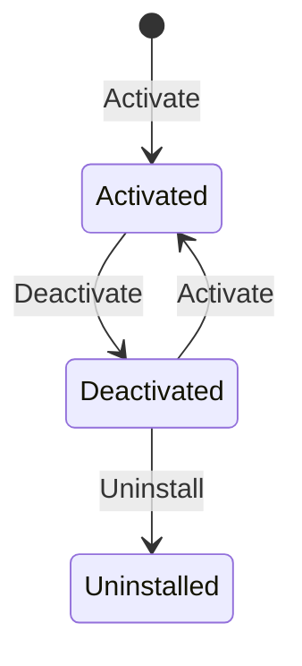

# Plugin life circle

Inside WordPress a plugin always follows the following life circle:

It is possible to take advantage of it, to execute some code at one of these steps.

## Activate

The activate logic is a logic that will be executed when the plugin is installed or re-activated.

Launchpad offers [an easy way to add logic](./activate.md) to execute on this step.

## Deactivate

The deactivate logic activated when the plugin is disabled.

Launchpad offers [an easy way to add logic](./deactivate.md) to execute on this step.

## Uninstall

The uninstall logic is activated when the plugin is deleted.

Launchpad offers [a module to add logic](./uninstall.md) to execute on this step.