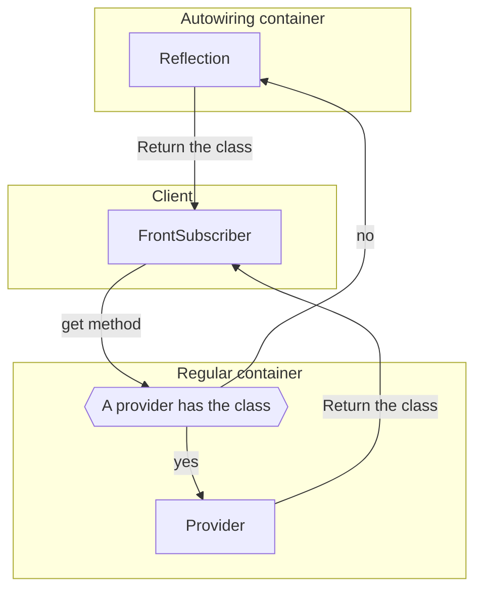

## Wiring classes
As the name of this strategy let you understand wiring is done automatically for most classes.

For that Launchpad framework will use the reflection API to resolve dependencies.
Depending on the dependency the resolver will use a different strategy:
- If it is a class it will use the reflection API to find the class and implement it.
- If it is a basic type or has no type it will search with the name of the parameter inside the container for a value.
- If no value is found then the resolver will search for a default value.

## Activating autowiring

By default, the auto wiring is enabled so there is nothing to enable it.

However, if you disabled it by the past then it is possible enable again it by adding the `autowiring` key with `true` value inside `configs/parameters.php`:

```php
...
return [
    ...
    'autowiring' => true
];
```

Once this enabled classes will then will be revolved that way:



## Registering subscribers

With Launchpad default behavior we have 4 subscriber types:
- Common subscribers: Subscribers that load on any context.
- Administrative subscribers: Subscribers that load only when the admin dashboard is loaded.
- Front-end subscribers: Subscribers that load only on pages visible by regular users.
- Initialisation subscribers: Subscribers loading before other to modify the loading logic.

To define the type from we need to register subscriber with the method matching the right type inside the `define` method:

```php
class Provider extends AbstractServiceProvider {
   public function define() {
    $this->register_common_subscriber(MyClass::class);
   }
}
```

| Type | Method |
|:----:|:------:|
| common | `register_common_subscriber`   |
| admin  | `register_admin_subscriber`   |
| front  | `register_front_subscriber`   |
| init   | `register_init_subscriber`   |

## Autowiring subscribers parameters

It is important to note that by default parameters from a subscriber are not autowired and this can be done using the method `autowire` on the registration:

```php
class Provider extends AbstractServiceProvider {
   public function define() {
    $this->register_common_subscriber(MyClass::class)->autowire();
   }
}
```

If the `autowiring` option is not enabled then the method `autowire` has not affect.

## Binding subscribers parameters

By default, parameters are not autowired and so it is possible to wire them manually using the usual `set_definition`.

More documentation about that is available on the [manual wiring page](./manual-wiring.md).